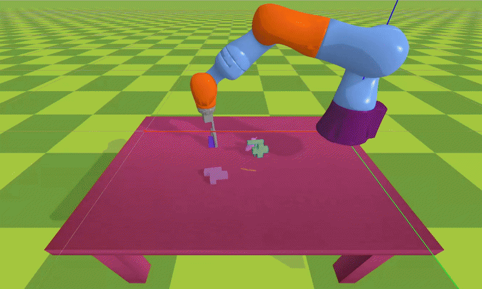

# Sim-to-Sim Robotic Grasping — Zero-Shot Pose Prediction & Transfer

> Zero-shot robotic grasp transfer from **PyBullet** → **ManiSkill** using RGB-based pose estimation and inverse kinematics.

---

## Overview

This project investigates **zero-shot transfer** of robotic grasping skills between simulation environments.  
A neural model predicts the **6-DoF pose** of target objects directly from RGB images in PyBullet,  
and the robot executes the grasp in ManiSkill using **inverse kinematics** — without additional fine-tuning.

By leveraging consistent geometric representations and visual features across domains,
the system achieves robust **cross-simulation generalization**, bridging the gap between simulation and real-world robotic manipulation.

---

## Features

- **Zero-shot transfer:** No retraining required when moving between PyBullet and ManiSkill.  
- **RGB-based pose estimation:** Predicts 3D object pose from single RGB input.  
- **Inverse kinematics control:** Executes precise grasp trajectories using estimated poses.  
- **Cross-domain robustness:** Maintains performance across different renderers and lighting conditions.  
- **Modular design:** Independent simulation, training, and control modules.

---

## Architecture

RGB Image ──► Pose Prediction Network ──► Inverse Kinematics ──► Grasp Execution

---

## Visualization

